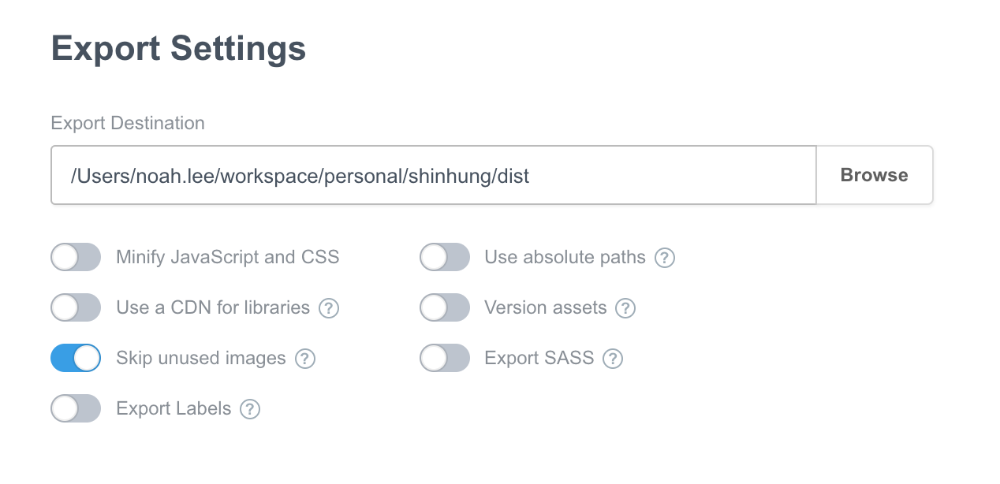

# Shinhung

## Structure

```shell
.
├── public    # export shinhung.bsdesign.
└── src     # import the source into Bootstrap studio.
    └── shinhung.bsdesign
```

## Contribute

### Import

1. `Open` 버튼 클릭
2. `shinhung/src/shinhung.bsdesign` 찾기
Open > `shinhung/src/shinhung.bsdesign` 찾기 > 오픈


### Export

1. `Export` 버튼 클릭
2. `Design` > `Export` 클릭
3. `shinhung/public/` 찾기 후 아래와 같이 export 실행



### Pull request

1. Checkout branch
```shell
$ git checkout -b BRANCH_NAME
```
2. Add changes
```shell
$ git add .
```
3. Commit and push origin
```shell
$ git commit -m "YOUR COMMIT MESSAGE"
$ git push origin BRANCH_NAME
```
4. Make Pull request in Github

[문서](https://opensource.com/article/19/7/create-pull-request-github) 확인.

# shinhung
