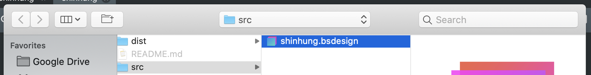
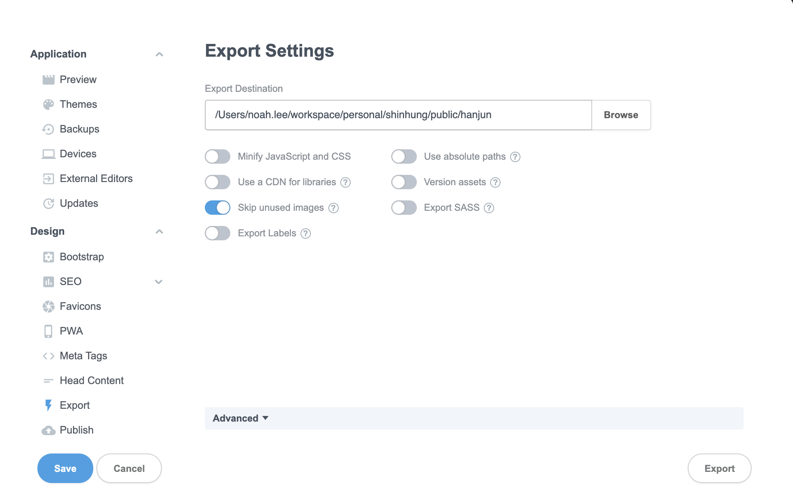
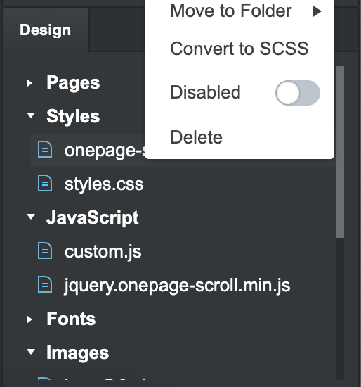

# Shinhung

## Structure

```shell
.
├── public    # export shinhung.bsdesign.
└── src     # import the source into Bootstrap studio.
    └── shinhung.bsdesign
```

## Contribute

### Init (optional)

1. `src/shinhung.bsdesign` -> `src/YOUR_NAME.bsdesign`으로 복사
2. [Import](#import) 작업 진행


### Import

1. `Open` 버튼 클릭
2. `shinhung/src/YOUR_NAME.bsdesign` 찾기
Open > `shinhung/src/YOUR_NAME.bsdesign` 찾기 > 오픈 후, 작업을 진행



### Export

1. `Export` 버튼 클릭
2. `shinhung/public/YOUR_NAME` 경로에 export



### Notes

#### Onepage scroll

onepage design을 위해서 jQuery [onepage-scroll](https://github.com/peachananr/onepage-scroll)이 추가된 상태이다. 그러나 **BS studio**에선 정상적으로 동작하지 않기 때문에 `onepage-scroll.css`를 `Disabled` 할 수 있도록 한다. 동작 확인은 Preview 기능을 통해서 브라우져를 이용한다.



## Deploy

1. Merge manually by BS design.
2. Export into `public/shinhung`

